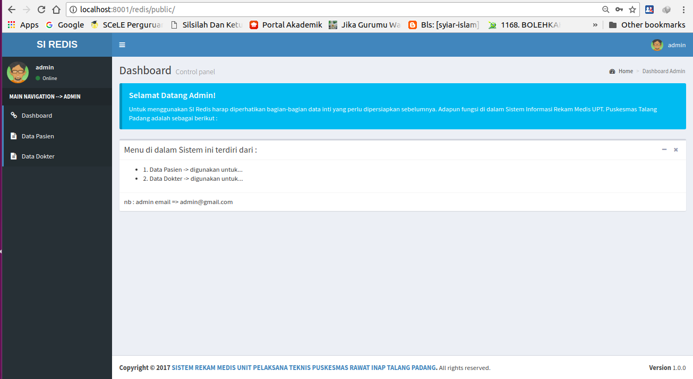
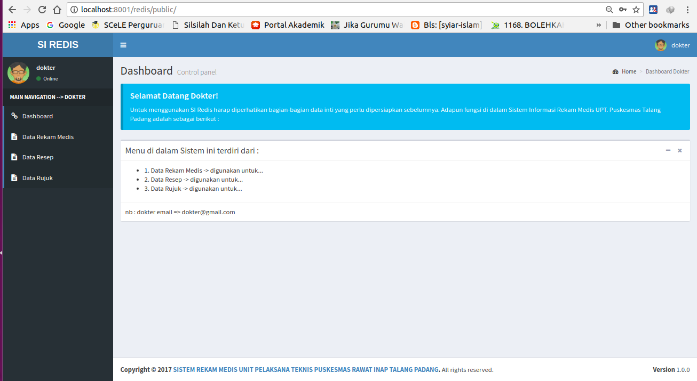
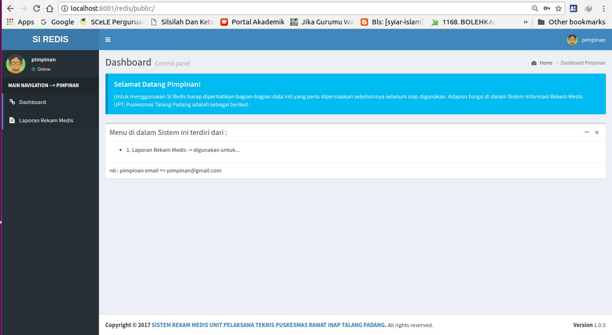
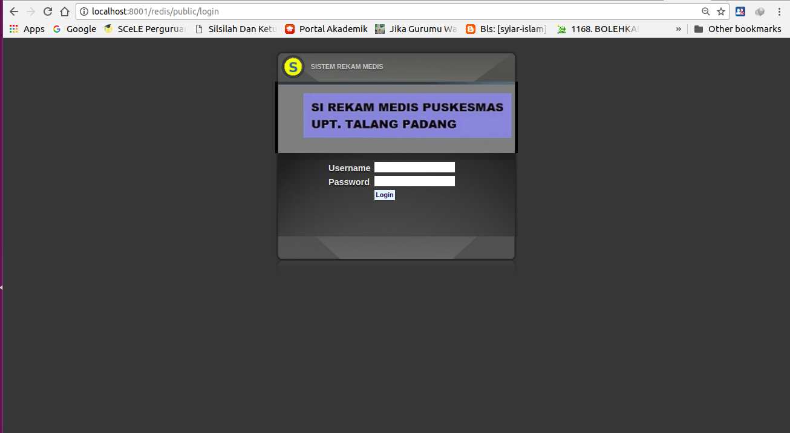

<h2 align="center">Sistem Informasi Rekam Medis untuk Puskesmas</h2>

## Cara Menjalankan Project

1. clone project ini di localhost anda atau di alamat ini `C:\xampp\htdocs`, lalu jalankan perintah ini diterminal `composer install`, perintah ini digunakan untuk menginstall library yg diperlukan.
2. Membuat Database yang dimulai dengan, membuka file `.env` di dalam folder project ini, lalu lengkapi data nya.
3. Buat database sesuai dengan nama yang telah anda berikab di dalam file `.env`.
4. Membuat Tabel serta melakukan pengisian pada tabel tersebut dengan cara :
   - buka explorer lalu ke lokasi folder project anda, lalu tekan tombol `shift` + `klik kanan` pada folder project anda tersebut
     lalu pilih perintah `open window command here`, maka akan muncul jendela cmd dengan lokasi di dalam folder project anda
   - setelah itu ketikkan perintah ini : - `php artisan migrate:refresh --seed`
   - setelah sukses Running program dengan cara ketikkan perintah ini :
     - `php artisan serve`
5. buka browser ketikkan di address bar perintah ini `localhost:8000`,
6. Setelah itu lakukan login dengan akun ini :

| nama       | username   | email              | password | level    |
| :--------- | :--------- | :----------------- | :------- | -------- |
| `admin`    | `admin`    | admin@gmail.com    | Sudah    | admin    |
| `dokter`   | `dokter`   | dokter@gmail.com   | Sudah    | dokter   |
| `pimpinan` | `pimpinan` | pimpinan@gmail.com | Sudah    | pimpinan |
| `teknisi`  | `teknisi`  | teknisi@gmail.com  | Sudah    | teknisi  |

11. Selesai.
12. Kabarkan ke saya jika tidak berhasil.
    | email | WA or Telegram | Instagram |
    | :------------------------ | :--------------------- | :---------------------------------------------- |
    | fari.msenju@gmail.com | 081215869294 | [Muhammad Fari Madyan.](https://www.instagram.com/farimadyan/) |

## Spesifikasi Project

- Laravel 5.2
- PHP 5.6
- MySQL Database

## Screenshot

1. Dashboard Admin
   
2. Dashboard Dokter
   
3. Dashboard Pimpinan
   
4. Dashboard Teknisi
   
5. Halaman Login
   
